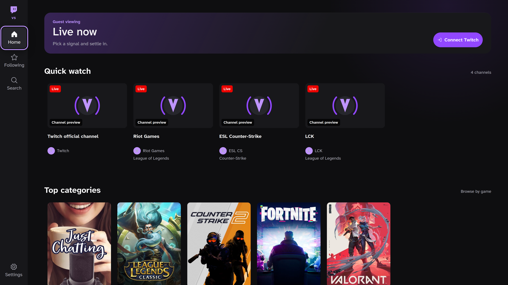

# VacuumStream

A controller-first Twitch client for Linux TVs and handhelds. Browse from the sofa with
four arrow keys, Enter, and Escape, or a gamepad. Playback uses Twitch's official player.

Guest-mode homepage captured during 4K interface testing. Channel previews depend on availability.

**Early-stage software.** Linux x86_64 builds target HTPCs, Steam Deck, and Bazzite.
Physical Steam Deck/Bazzite validation and authenticated playback testing remain ongoing;
these are target platforms, not a hardware certification. Windows, macOS, and ARM builds
are not currently provided.

## Get started

Download an AppImage or Flatpak from [GitHub Releases](https://github.com/eliottness/VacuumStream/releases),
then follow the [installation and first-run guide](docs/users/getting-started.md).
If there is no published release yet, use the [source setup](docs/contributing/development.md).

- Watch quick-pick channels or search an exact channel name without signing in.
- Connect your Twitch account to browse live streams, followed channels, categories, and VODs.
- A public Twitch Client ID is built in. You do **not** need to register a developer application.
- Device sign-in unlocks discovery; it does not sign the embedded player into your account.
- Twitch controls ads, availability, and player errors. VacuumStream does not bypass them.

## Documentation

| I want to… | Start here |
| --- | --- |
| Install, sign in, or use a controller | [User guide](docs/users/getting-started.md) |
| Troubleshoot playback, login, or startup | [Troubleshooting](docs/users/troubleshooting.md) |
| Report a bug or contribute | [Contributing](CONTRIBUTING.md) |
| Run or change the source | [Development](docs/contributing/development.md) |
| Understand the security boundaries | [Architecture](docs/contributing/architecture.md) |
| Change the interface | [Design contract](docs/contributing/design.md) |
| Publish a version | [Maintainer release guide](docs/maintainers/releases.md) |
| Report a vulnerability | [Security policy](SECURITY.md) |

## Project

Maintained by [Eliott Bouhana (@eliottness)](https://github.com/eliottness), with contributions
credited in [Git history](https://github.com/eliottness/VacuumStream/graphs/contributors).
The application ID is `io.github.eliottness.VacuumStream`.

Inspired by VacuumTube's controller-first approach. Twitch has no equivalent supported
Leanback interface, so VacuumStream provides its own interface using Helix, Device Code Flow,
and the official Twitch player rather than extracting stream URLs.

[MIT licensed](LICENSE). Twitch is a trademark of Twitch Interactive, Inc.
VacuumStream is not affiliated with or endorsed by Twitch.
